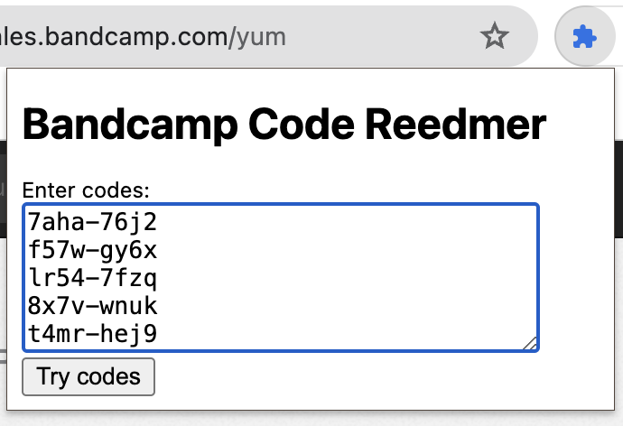

# bandcamp-redeemer

A Chrome Extension to try bandcamp redeem codes until one works.

## Setup
Hopefully published to the Chrome Web Store soon. For now you can install as an unpacked extension as using the instructions here:

https://developer.chrome.com/docs/extensions/get-started/tutorial/hello-world#load-unpacked

## Usage
When on a bandcamp yum page, click the extension and paste the codes into the text box in the popup.

If it works, enter email if desired, then hit redeem.

## Thanks

:black_heart: A big thanks to all the labels and artists that offer their music for free with these redeem codes :black_heart:
